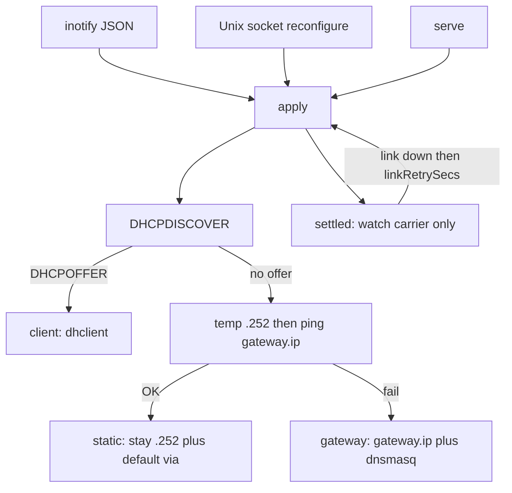

# micronet — Architecture

This file is the canonical architecture source. Event WiFi cabling and
operator checklists live in [`docs/networking/`](docs/networking/README.md).

`micronet` is the network daemon for BigFred OS. It **owns every
cable Ethernet interface** on the hub (physical `ARPHRD_ETHER`; not
Wi-Fi, loopback, bridge, or virtual): it picks **one** with a cable,
admin-downs the rest, probes for a foreign DHCP server, optionally
pings `gateway.ip`, and applies one of three modes (`client` /
`gateway` / `static`). Clients on the same L2 subnet need **no extra
routing table**: dnsmasq `option:router` and `option:dns-server` are
enough; `ip addr add` installs the connected route. This task does
**not** enable `ip_forward` or NAT.

---

## 1. Assumptions

1. **One daemon, one crate.** Replaces `configure-ethernet` +
   `configure-dhcp`. Aliases of those names may still invoke the same ELF
   (`argv0` → `apply` / `check`) for one release.
2. **Data root.** `--data-dir` sets `DATA_DIR`; env `DATA_DIR` must be
   absolute; otherwise `/data`. All files are `{root}/etc/…` and
   `{root}/run/…`. JSON **MUST NOT** contain hardcoded `/data/...`.
3. **Three modes** as `enum Mode { Client, Gateway, Static }` — not a
   bool ladder. dnsmasq runs only in `gateway`.
4. **Physical Ethernet only.** `ARPHRD_ETHER`, no `wireless`, sysfs
   realpath without `/devices/virtual/`, no bridge master, no
   `IFF_LOOPBACK`. micronet **manages all** such interfaces: exactly
   one is up with an address; the others are flushed and
   `ip link set down`. `interface` `null` / omitted / `"auto"` selects
   the first candidate that already shows sysfs `carrier=1` (no link
   churn). Only if none have carrier does it `ip link set up` down
   candidates and wait up to **5 s** for PHY/USB negotiation; still
   none → first sorted name. Any other configured name MUST pass the
   same filter (pinned device; re-select still waits `linkRetrySecs`
   on that name).
5. **No NAT / `ip_forward`.** Isolated event LAN. Gateway mode has **no**
   default route. Static mode **does** `default via gateway.ip`.
6. **dnsmasq** is DHCP+DNS for the event pool only (`listen-address` =
   `gateway.ip`). Lease stickiness is `dhcp-range=…,<sticky>` (default
   `7d`) plus `$DATA_DIR/etc/dnsmasq.leases`. No Omada `dhcp-host=`.
   Optional JSON `dns` (`enabled` + `records[]`) adds `host-record=` and
   `local=/lan/` in gateway mode. `addr` is IPv4; omitted `addr` uses
   `gateway.ip`. Unicast names disappear in `client` / `static`
   (dnsmasq is stopped).
7. **IPC** is 4-byte little-endian length + JSON (`status` / `info` /
   `reconfigure`). Max frame `MAX_IPC_FRAME_BYTES`; max concurrent
   clients `MAX_IPC_CLIENTS`.
8. **`std::thread`**, no tokio. `unsafe_code = "forbid"`.
9. **arm64 musl** static binary. Clippy deny `unwrap_used` / `expect_used`
   / `panic` / `todo` (workspace lints).
10. **Binary defaults** `192.168.0.1/24`. BigFred OS seeds
    `$DATA_DIR/etc/micronet.json` from the image overlay (**`192.168.0.1` /
    `192.168.0.0/24`**) when the file is missing.
11. **Choose once, then watch the link.** After start (or JSON reload /
    `reconfigure`), the daemon holds the chosen iface + mode. It does
    **not** re-probe DHCP or other ifaces. Unplug: wait `linkRetrySecs`
    (JSON, default **15**); if the cable returns, do nothing. If not,
    one full re-select. That is the only path back to “pick iface +
    decide mode.”
12. **Health is the daemon’s.** `micronet check` reads IPC `healthy`.
    No carrier is healthy (micronet recovers itself). Missing dnsmasq /
    dhclient is self-healed in place. IPC reports unhealthy only after
    `HEALTH_FAIL_THRESHOLD` consecutive failed ticks (~9 s). microinit
    restarts `network` only when the process is dead or health stays
    failed.

---

## 2. Coding Rules

New and changed code **MUST** follow
[CODING-GUIDELINES.md](CODING-GUIDELINES.md) (verbatim copy of microinit).
Review filter:

- Administrative crate = **allocation-conscious**. Bounds on IPC frames,
  probe timeouts, watcher debounce, client count.
- No God-struct in `daemon`. One job per directory (`config` does not
  start dnsmasq).
- Modes as enum. Illegal combinations (dnsmasq in `client`) are not
  representable in `Status`.
- `thiserror`; **MUST NOT** `unwrap` / `expect` / `panic` on production
  paths. Operator validation returns `Err`, not `debug_assert`.
- Bounded channels; `std::thread`.

---

## 3. High-level



---

## 4. Workspace layout

```
crates/micronet/src/
  main.rs, lib.rs, error.rs, datadir.rs, constants.rs, version.rs, signals.rs, pidfile.rs
  config/     JSON + inotify watch
  net/        physical Ethernet, probe, addr
  dhcp/       dnsmasq conf + process
  apply/      Mode + state machine
  ipc/        Unix socket
  daemon/     loop
docs/networking/   operator mount (EN + PL)
plans/             event WiFi design notes
CODING-GUIDELINES.md
ARCHITECTURE.md
```

---

## 5. Module responsibilities

| Dir | Job |
|---|---|
| `config` | camelCase JSON, validate, load_or_create (example **without** `socket`), inotify debounce ~300 ms |
| `net` | iface filter + carrier-based auto pick (do not admin-up ifaces that already have carrier), `ip` / `ping` / pidfile-owned `dhclient`, DHCPDISCOVER encode/probe, best-effort `ethtool` EEE/TSO/GSO/coalesce off **only when actually bringing a link up** |
| `dhcp` | render `dnsmasq.conf`, start / SIGHUP / restart / stop (pidfile only) |
| `pidfile` | TERM/KILL one process; never `killall` |
| `apply` | one `apply(cfg)`: isolate + one DHCPDISCOVER + ping + mode apply; teardown |
| `ipc` | `bind_singleton`, framing; `status` includes `healthy` / `unhealthyReason` |
| `daemon` | watch + IPC + apply; then only carrier + self-heal; socket path is **not** hot-reloaded |

`net` and `dhcp` MUST NOT import `ipc`.

---

## 6. Mode selection

0. Resolve the iface: `null` / omitted / `"auto"` → first physical Ethernet
   that already has carrier (no `ip link set up` on anyone). If none,
   admin-up **down** candidates and wait ≤ **5 s**; still none → first
   sorted name. An explicit name skips this pick.
0a. **Isolate:** every other physical Ethernet that is still up or has
   an address is `dhclient`-stopped, address-flushed, and admin-down.
   Already-down ifaces without an address are left alone.
1. Link up only if the chosen iface is admin-down. `ethtool` PHY tweaks
   run **only** on that transition (`--set-eee … eee off`, `-K tso/gso
   off`, `-C rx-usecs 0 tx-usecs 0`); log and continue on missing binary
   / ENOTSUP. Stop leftover `dhclient` (per-iface pidfile).
2. Stop **our** dnsmasq before DHCPDISCOVER (do not offer to ourselves).
3. DHCPDISCOVER, wait `probeTimeoutSecs` for a DHCPOFFER that matches
   `xid`, `chaddr`, `BootReply`, Ethernet, option 53 = Offer.
4. Probe **errors** (bind, `SO_BINDTODEVICE`, send) abort apply — fail
   closed. Do **not** start dnsmasq when the probe did not complete.
5. Valid offer → `client` (`dhclient -nw` with pidfile/leasefile).
6. Else, if the iface has **no** IPv4 yet, assign `staticHost` (default
   **252**). Ping `gateway.ip` (`-c 1 -W 2`). If `gateway.ip` is already
   a local inet on **any** interface, treat ping as fail (stay / become
   gateway) — do not mistake our own leftover `.1` for a foreign router.
7. Ping OK → `static` (keep `.252`, `default via gateway.ip`, stop dnsmasq).
8. Ping fail → `gateway`. If the iface already has `gateway.ip/prefix`,
   do **not** flush; only `del_default` + dnsmasq reload. Otherwise drop
   `.252`, add `gateway.ip/prefix`, start dnsmasq, **no** default route.

`status.cidr` is always a real IPv4 prefix (`a.b.c.d/24`) or `null`.

`staticHost` MUST lie in the `/24`, differ from `gateway.ip`, and sit
outside `[rangeStart, rangeEnd]`.

### 6.1 After apply: watch the link only

There is **no** periodic DHCPDISCOVER and **no** yield-to-client path.
A foreign DHCP server that appears **without** a link break is not
detected until the next select (start, JSON reload, IPC `reconfigure`,
or unplug longer than `linkRetrySecs`). That is intentional: fewer
moving parts, no restart loops.

Every `STATUS_REFRESH` (3 s):

- Carrier OK → refresh CIDR / dnsmasq flag; if gateway without dnsmasq
  restart it in place; if client without dhclient restart it. Health
  uses `assess` (no carrier → healthy). Unhealthy only after three
  consecutive failed ticks.
- Carrier lost → log once `link down on {iface}; retrying for Ns`. If
  it returns before `linkRetrySecs`, do nothing to the network. If not:
  `link not restored; re-selecting interface` and one full `apply`.

`linkRetrySecs` is JSON (`15` default, must be > 0).

Process ownership: `$DATA_DIR/run/dnsmasq.pid` and
`$DATA_DIR/run/dhclient.<iface>.pid`. Never `killall`.

Two operator kits (daemon only sees DHCP + ping at select time):

- **TL-SF1006P only** — empty LAN → `gateway`, BigFred DHCP.
- **TL-SF1006P + any router on the switch** — power the router **before**
  BigFred (or unplug/replug the hub cable after the router is up) so
  the select-time probe sees foreign DHCP → `client` / `static`. APs
  stay on the switch PoE ports (Omada PoE is not compatible with
  MikroTik hEX PoE).

---

## 7. Hot-reload (JSON + dnsmasq)

Invalid JSON: keep previous config, log a warning.

- Socket path is not hot-reloaded.
- JSON reload and IPC `reconfigure` both run a **full** `apply` (stop
  own dnsmasq, DHCPDISCOVER, decide). That is a select, not a patch.

dnsmasq when the new mode is `gateway` and generated conf changed:

1. Write `$DATA_DIR/etc/dnsmasq.conf`.
2. If not running → start.
3. If running: SIGHUP; **restart** (TERM then `dnsmasq -C`) when SIGHUP
   fails **or** the main conf changed (`dhcp-range`, `listen-address`,
   `interface`, `dhcp-option`, lease time — SIGHUP does not re-read these).
4. If the process vanished after SIGHUP → start.
5. Mode `client` / `static`: **stop** leftover dnsmasq; do not rewrite
   conf as a server.

Unchanged conf → do not touch the process.

---

## 8. IPC

Requests `{ "type": "status" | "info" | "reconfigure" }`.

`status` fields (camelCase): `mode`, `iface`, `cidr`, `foreignDhcp`,
`gatewayReachable`, `dnsmasqRunning`, `healthy`, `unhealthyReason`.

CLI: `serve` / `run` (default), `apply`, `status`, `check`, `teardown`,
`reconfigure`, `info`. Global `--config`, `--socket`, `--data-dir`.
Relative `--socket` / `--config` join under the data root; absolute
`--socket` is CLI-only (tests).

`micronet check` (microinit): IPC must succeed; then the daemon’s
`healthy` flag. No live `ip` / pidfile probes in the check process.
No carrier → healthy. Apply in progress → healthy. Missing mode
process is self-healed first; three failed ticks → `healthy: false`
with `unhealthyReason` logged at warn (visible in `microinit logs
network`).

`configure-ethernet` / `configure-dhcp check`: same IPC health when the
daemon socket answers; if the socket is missing, iface UP + IPv4 only
(legacy one-shot after `apply` exited).

`micronet teardown`: stop our dnsmasq and dhclient, flush **all**
physical Ethernet addresses, delete the default route (full service stop).

---

## 9. Integration

- microinit service `network`: `daemon: true`, `exec /usr/sbin/micronet serve`,
  liveness `micronet check` (~20 s, timeout 10 s). Stop runs `micronet teardown`.
- `configure-dhcp` service is removed.
- bigfred-os fetch installs `/usr/sbin/micronet` (optional argv0 aliases).
- Overlay `etc/micronet/micronet.json` seeds `$DATA_DIR/etc/micronet.json`
  **only if missing** (operator edits survive), default subnet `192.168.0.0/24`.
