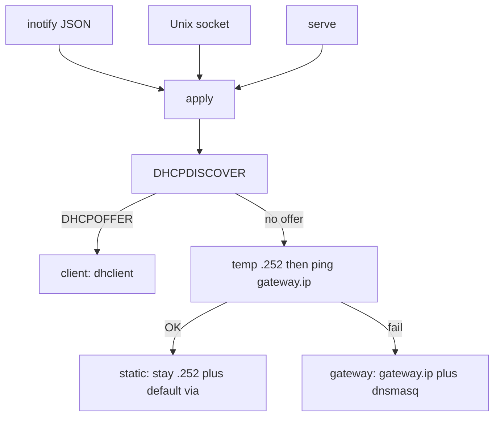

# micronet — Architecture

This file is the canonical architecture source. Event WiFi cabling and
operator checklists live in [`docs/networking/`](docs/networking/README.md).

`micronet` is the network daemon for BigFred OS: it brings up **physical
Ethernet**, probes for a foreign DHCP server, optionally pings
`gateway.ip`, and applies one of three modes (`client` / `gateway` /
`static`). Clients on the same L2 subnet need **no extra routing table**:
dnsmasq `option:router` and `option:dns-server` are enough; `ip addr add`
installs the connected route. This task does **not** enable
`ip_forward` or NAT.

---

## 1. Assumptions

1. **One daemon, one crate.** Replaces `configure-ethernet` +
   `configure-dhcp`. Aliases of those names may still invoke the same ELF
   (`argv0` → `apply` / `check`) for one release.
2. **Data root.** `--data-dir` sets `DATA_DIR`; env `DATA_DIR` must be
   absolute; otherwise `/data`. All files are `{root}/etc/…` and
   `{root}/run/…`. JSON **MUST NOT** contain hardcoded `/data/...`.
3. **Three modes** as `enum Mode { Client, Gateway, Static }` — not a
   bool ladder. dnsmasq runs only in `gateway`.
4. **Physical Ethernet only.** `ARPHRD_ETHER`, no `wireless`, sysfs
   realpath without `/devices/virtual/`, no bridge master, no
   `IFF_LOOPBACK`. Configured `interface` MUST pass the same filter.
5. **No NAT / `ip_forward`.** Isolated event LAN. Gateway mode has **no**
   default route. Static mode **does** `default via gateway.ip`.
6. **dnsmasq** is DHCP+DNS for the event pool only (`listen-address` =
   `gateway.ip`). Lease stickiness is `dhcp-range=…,<sticky>` (default
   `7d`) plus `$DATA_DIR/etc/dnsmasq.leases`. No Omada `dhcp-host=`.
7. **IPC** is 4-byte little-endian length + JSON (`status` / `info` /
   `reconfigure`). Max frame `MAX_IPC_FRAME_BYTES`; max concurrent
   clients `MAX_IPC_CLIENTS`.
8. **`std::thread`**, no tokio. `unsafe_code = "forbid"`.
9. **arm64 musl** static binary. Clippy deny `unwrap_used` / `expect_used`
   / `panic` / `todo` (workspace lints).
10. **Binary defaults** `192.168.0.1/24`. BigFred OS seeds
    `$DATA_DIR/etc/micronet.json` to **`10.0.10.1` / `10.0.10.0/24`**
    when the file is missing.

---

## 2. Coding Rules

New and changed code **MUST** follow
[CODING-GUIDELINES.md](CODING-GUIDELINES.md) (verbatim copy of microinit).
Review filter:

- Administrative crate = **allocation-conscious**. Bounds on IPC frames,
  probe timeouts, watcher debounce, client count.
- No God-struct in `daemon`. One job per directory (`config` does not
  start dnsmasq).
- Modes as enum. Illegal combinations (dnsmasq in `client`) are not
  representable in `Status`.
- `thiserror`; **MUST NOT** `unwrap` / `expect` / `panic` on production
  paths. Operator validation returns `Err`, not `debug_assert`.
- Bounded channels; `std::thread`.

---

## 3. High-level



---

## 4. Workspace layout

```
crates/micronet/src/
  main.rs, lib.rs, error.rs, datadir.rs, constants.rs, version.rs, signals.rs, pidfile.rs
  config/     JSON + inotify watch
  net/        physical Ethernet, probe, addr
  dhcp/       dnsmasq conf + process
  apply/      Mode + state machine
  ipc/        Unix socket
  daemon/     loop
docs/networking/   operator mount (EN + PL)
plans/             event WiFi design notes
CODING-GUIDELINES.md
ARCHITECTURE.md
```

---

## 5. Module responsibilities

| Dir | Job |
|---|---|
| `config` | camelCase JSON, validate, load_or_create (example **without** `socket`), inotify debounce ~300 ms |
| `net` | iface filter, `ip` / `ping` / pidfile-owned `dhclient`, DHCPDISCOVER encode/probe |
| `dhcp` | render `dnsmasq.conf`, start / SIGHUP / restart / stop (pidfile only) |
| `pidfile` | TERM/KILL one process; never `killall` |
| `apply` | probe policy, mode apply, teardown, live health |
| `ipc` | `bind_singleton`, framing |
| `daemon` | watch + IPC + apply + gateway recheck; socket path is **not** hot-reloaded |

`net` and `dhcp` MUST NOT import `ipc`.

---

## 6. Mode selection

1. Link up, no address; stop **our** leftover `dhclient` (per-iface pidfile).
2. If currently serving DHCP, stop **our** dnsmasq before a full probe (do not
   offer to ourselves).
3. DHCPDISCOVER, wait `probeTimeoutSecs` for a DHCPOFFER that matches
   `xid`, `chaddr`, `BootReply`, Ethernet, option 53 = Offer.
4. Probe **errors** (bind, `SO_BINDTODEVICE`, send) abort apply — fail
   closed. Do **not** start dnsmasq when the probe did not complete.
5. Valid offer → `client` (`dhclient -nw` with pidfile/leasefile).
6. Else assign `staticHost` (default **252**), ping `gateway.ip`
   (`-c 1 -W 2`). If `gateway.ip` is already local, treat ping as fail
   (stay / become gateway).
7. Ping OK → `static` (keep `.252`, `default via gateway.ip`, stop dnsmasq).
8. Ping fail → `gateway` (drop `.252`, `gateway.ip/prefix`, dnsmasq,
   **no** default route).

`status.cidr` is always a real IPv4 prefix (`a.b.c.d/24`) or `null`.

`staticHost` MUST lie in the `/24`, differ from `gateway.ip`, and sit
outside `[rangeStart, rangeEnd]`.

### 6.1 Gateway yield (foreign DHCP appears later)

While `mode == gateway`, every `GATEWAY_FOREIGN_DHCP_INTERVAL` (15 s)
the daemon sends DHCPDISCOVER **without** stopping dnsmasq (one in-flight
probe, off the main loop). Offers from our own server-id / local inet
are ignored. A foreign offer → stop **our** dnsmasq immediately and
become `client`. Yield is **one-way**; returning to gateway requires
`reconfigure` or a process restart.

Periodic probe errors stay gateway (already serving; uncertainty is not
a yield). JSON reload while gateway still skips DISCOVER (`SkipDhcpWhileGateway`);
the periodic probe covers “router appeared later.” IPC `reconfigure` is
always a full probe.

Process ownership: `$DATA_DIR/run/dnsmasq.pid` and
`$DATA_DIR/run/dhclient.<iface>.pid`. Never `killall`.

Two operator kits (daemon only sees DHCP + ping):

- **TL-SF1006P** — empty LAN → `gateway`, BigFred DHCP.
- **MikroTik hEX PoE lite RB750UPr2** — ether1 BigFred (no PoE),
  ether2–5 PoE to APs; router DHCP → `client` / `static`.

---

## 7. Hot-reload (JSON + dnsmasq)

Invalid JSON: keep previous config, log a warning.

- Socket path is not hot-reloaded.
- Reload while **not** `gateway`: full probe (DHCP + ping).
- Reload while **`gateway`**: skip DHCPDISCOVER; re-ping only if
  `gateway.ip` is not ours; rewrite address/pool as needed.
- IPC `reconfigure`: always full probe (stop own dnsmasq first).

dnsmasq when the new mode is `gateway` and generated conf changed:

1. Write `$DATA_DIR/etc/dnsmasq.conf`.
2. If not running → start.
3. If running: SIGHUP; **restart** (TERM then `dnsmasq -C`) when SIGHUP
   fails **or** the main conf changed (`dhcp-range`, `listen-address`,
   `interface`, `dhcp-option`, lease time — SIGHUP does not re-read these).
4. If the process vanished after SIGHUP → start.
5. Mode `client` / `static`: **stop** leftover dnsmasq; do not rewrite
   conf as a server.

Unchanged conf → do not touch the process.

---

## 8. IPC

Requests `{ "type": "status" | "info" | "reconfigure" }`.

`status` fields (camelCase): `mode`, `iface`, `cidr`, `foreignDhcp`,
`gatewayReachable`, `dnsmasqRunning`.

CLI: `serve` / `run` (default), `apply`, `status`, `check`, `teardown`,
`reconfigure`, `info`. Global `--config`, `--socket`, `--data-dir`.
Relative `--socket` / `--config` join under the data root; absolute
`--socket` is CLI-only (tests).

`micronet check` (microinit): IPC must succeed, then **live** health —
ignore cached `cidr`. No carrier → success (do not restart on unplug).
Carrier up requires a live IPv4 and the owned process (`dnsmasq` in
gateway, `dhclient` in client, address only in static).

`configure-ethernet` / `configure-dhcp check`: same live check when the
daemon socket answers; if the socket is missing, iface UP + IPv4 only
(legacy one-shot after `apply` exited).

`micronet teardown`: stop our dnsmasq and dhclient, flush the managed
iface, delete the default route (full service stop).

---

## 9. Integration

- microinit service `network`: `daemon: true`, `exec /usr/sbin/micronet serve`,
  liveness `micronet check` (~20 s). Stop runs `micronet teardown`.
- `configure-dhcp` service is removed.
- bigfred-os fetch installs `/usr/sbin/micronet` (optional argv0 aliases).
- Overlay `etc/micronet/micronet.json` seeds `$DATA_DIR/etc/micronet.json`
  **only if missing** (operator edits survive), event subnet `10.0.10.0/24`.
